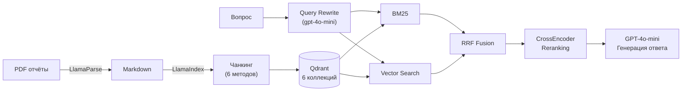

# RAG Pipeline: Q&A по годовым отчётам казахстанских компаний

Учебный проект — RAG (Retrieval-Augmented Generation) pipeline для вопросно-ответной системы по годовым отчётам казахстанских компаний. Сравнение 6 стратегий чанкинга, Naive vs Advanced RAG, оценка качества через RAGAS.

## Архитектура



**Naive RAG** (метод `fixed`): Вопрос → Embedding → Cosine Search → GPT-4o-mini

**Advanced RAG** (остальные 5 методов): Вопрос → Query Rewrite → Hybrid BM25 + Vector → RRF Fusion → CrossEncoder Rerank → GPT-4o-mini

## Стек технологий

| Компонент | Технология | Назначение |
|-----------|-----------|------------|
| Оркестрация | LlamaIndex 0.14 | Чанкинг, индексация, retrieval |
| Парсинг PDF | LlamaParse (premium) | PDF → чистый Markdown |
| Эмбеддинги | OpenAI `text-embedding-3-large` | Векторные представления (3072 dims) |
| Генерация | GPT-4o-mini | Ответы и query rewrite |
| Векторная БД | Qdrant (локальный) | Хранение и поиск эмбеддингов |
| Реранкинг | `BAAI/bge-reranker-v2-m3` | CrossEncoder для переранжирования |
| BM25 | rank-bm25 | Лексический поиск для гибридного retrieval |
| Оценка | RAGAS 0.4 | Faithfulness, Relevancy, Precision, Recall |

## 6 методов чанкинга

| Метод | Коллекция | Чанков | Описание |
|-------|-----------|--------|----------|
| Fixed | `rag_fixed` | 71 | Naive RAG — фиксированный размер, без rewrite/rerank |
| Recursive | `rag_recursive` | 70 | TokenTextSplitter с перекрытием |
| Layout | `rag_layout` | 95 | MarkdownElementParser — сохраняет таблицы атомарно |
| Semantic | `rag_semantic` | 45 | SemanticSplitterNodeParser — по смысловым границам |
| Parent-Child | `rag_parent_child` | 120 | 120 leaf-нод (512t), родительский контекст 2048t |
| Sentence Window | `rag_sentence_window` | 570 | По предложению, окно контекста ±3 предложения |

## Структура проекта

```
rag_pipeline/
├── config.py              # Центральная конфигурация (модели, параметры чанкинга, API)
├── llama_parse.py         # PDF → Markdown через LlamaParse API
├── index_llama.py         # Markdown → чанки → Qdrant (6 методов индексации)
├── ask_llama.py           # Q&A: query rewrite → hybrid retrieval → rerank → GPT-4o-mini
├── evaluate_rag.py        # RAGAS-оценка и greedy search экспериментов
├── requirements.txt       # Зависимости
├── golden_dataset.json    # Золотой датасет (30 вопросов с reference answers) (не в репо)
├── full_rag_pipeline.ipynb # Jupyter notebook с полным анализом (не в репо)
├── *_clean.md             # Очищенные Markdown-файлы отчётов (не в репо)
├── qdrant_data/           # Локальное хранилище Qdrant (не в репо)
└── .env                   # API ключи (не в репо)
```

## Быстрый старт

### 1. Клонирование и установка

```bash
git clone <repo-url>
cd rag_pipeline
python -m venv .venv
source .venv/bin/activate  # Windows: .venv\Scripts\activate
pip install -r requirements.txt
```

### 2. Настройка API ключей

Создайте файл `.env` в корне проекта:

```env
OPENAI_API_KEY=sk-...
LLAMA_CLOUD_API_KEY=llx-...
```

### 3. Парсинг PDF (если нужно)

```bash
# Парсинг PDF в Markdown
python llama_parse.py input.pdf output.md

# Только очистка существующего Markdown
python llama_parse.py --clean-only existing.md
```

### 4. Индексация

```bash
# Все 6 методов с пересозданием коллекций
python index_llama.py --method all --reset

# Один конкретный метод
python index_llama.py --method layout
```

### 5. Задаём вопросы

```bash
# Простой вопрос
python ask_llama.py --method semantic "Какова выручка компании за 2024 год?"

# С показом найденных чанков
python ask_llama.py --method layout "Основные риски компании" --show-chunks

# Изменить количество результатов
python ask_llama.py --method semantic "вопрос" --top-k 10

# Прогнать тестовые вопросы (без аргумента query)
python ask_llama.py --method semantic
```

## Оценка качества (RAGAS)

Модуль `evaluate_rag.py` запускает серию экспериментов с greedy search по параметрам и оценивает через RAGAS:

**Метрики:**
- **Faithfulness** — соответствие ответа найденному контексту
- **Response Relevancy** — релевантность ответа вопросу
- **Context Precision** — точность контекста (были ли нужные чанки в топе)
- **Context Recall** — полнота контекста (все ли факты из reference покрыты)

```bash
# Все эксперименты
python evaluate_rag.py

# Только отдельные группы (по номеру)
python evaluate_rag.py --experiments 0 1

# Быстрый тест (3 вопроса)
python evaluate_rag.py --quick
```

**Золотой датасет**: 30 вопросов — 15 числовых (точные KPI), 10 качественных, 2 сравнительных (2024 vs 2023), 3 негативных (данных нет в отчётах).

## Известные ограничения

**Многоколоночные финансовые таблицы.** RAG фундаментально плохо справляется с чтением правильного столбца из таблиц вида `| 52.1% | 44.3% | 34.6% |` без явного контекста года в чанке. Это архитектурное ограничение, не решаемое настройкой промпта или TOP_K. Продакшен-решение: structured extraction (Text-to-SQL, tool calling).

**RAGAS `factual_correctness` ненадёжна для русского текста.** GPT-4o-mini как судья RAGAS плохо справляется с claim extraction и NLI для русского финансового текста. Абсолютные значения FC (0.17–0.25) — артефакт метрики, а не реальная точность. Причины: слабый русский NLI у gpt-4o-mini, русское форматирование чисел (`2 163,9`), штрафование за дополнительный контекст в ответе. FC пригодна только для относительного сравнения между экспериментами.

**Локальный Qdrant.** Однопроцессный режим (file lock) — нельзя запускать несколько методов параллельно.
